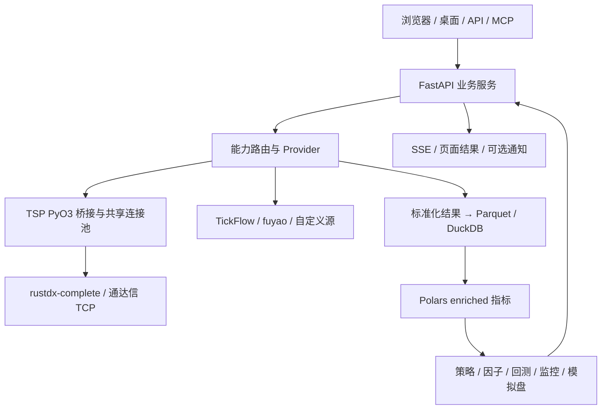

# TSP 当前项目分析说明（2026-10-10）

本文以当前工作区的代码、锁文件、专项测试及本地运行证据为依据，重点解释
rustdx 如何融入整套研究系统，并区分已经实现、已经验证和仍待验收的内容。
这是一次版本状态分析，不是功能变更或上线记录。

## 1. 总体判断与版本范围

TSP 已形成“行情采集 → 数据标准化 → 本地数据发布 → 指标与策略 →
回测与盘中监控”的完整工程链路。rustdx 是其中的协议和采集基础，
策略算法、交易模拟和数据治理由 TSP 的 Python 领域模块承担。

当前最需要继续完善的是端到端刷新性能、历史数据的时点完整性、
运行告警收敛和多平台发布验收。现有证据支持 rustdx 接入及主要契约可用，
不能据此断言全部历史研究数据完整或全部部署平台已经验收。

### 1.1 三种版本状态

| 范围 | 本次确认的状态 |
| --- | --- |
| 应用版本 | 后端与前端均为 `0.3.11` |
| 本地 Git HEAD | `2a7afccdd230811e0993f32d5f10b4317f259042` |
| 本地缓存的 `origin/main` | 与上述 HEAD 相同；本次未 fetch，因此不声称远端没有后续变化 |
| 当前工作区 | 存在未提交修改，包括移除 mootdx、独立 rustdx Provider 和沪深范围统一 |
| 本机运行环境 | macOS arm64、Python 3.12.14；原生桥接可加载，七项能力均路由 rustdx |
| 线上环境 | 会话此前最后部署记录为 `f42c292`；本次未访问服务器重新确认 |

因此，“当前工作区已经实现”与“GitHub 已提交”必须分开解释。
本次仅新增分析文档，未发布当前迁移版本或操作线上数据。

### 1.2 当前 rustdx 实现

当前工作区使用独立 `RustdxProvider`：

- Python Provider 直接调用 TSP 的 rustdx 原生桥接。
- mootdx 插件及其运行依赖已经删除。
- 保留原有标准化契约及相应回归测试。
- 旧配置中的 `mootdx` 路由在读取时转换为 `rustdx`，下次普通保存时持久化。
- TickFlow、fuyao 和自定义 Provider 仍可按能力独立选择。

本机检查确认 `mootdx`、`tdxpy`、`pytdx` 三个包均未安装。
当前运行方式是 Rust 协议核心加独立 Python 适配层，后续优化建议以
rustdx 的节点、连接池、数据口径和调度实现为依据。

## 2. 项目定位与技术架构

TSP 是面向沪深市场的数据治理和量化研究工作台，采用模块化单体。
它同时支持数据页面、选股、因子研究、策略回测、盘中异动、集合竞价、
自选监控、模拟盘、AI 分析和开放 API。模拟盘不连接券商交易系统。

### 2.1 技术分工

| 技术 | 当前职责 |
| --- | --- |
| React 18、TypeScript、Vite | Web 页面与桌面内嵌页面 |
| TanStack Query | 前端共享查询、缓存与刷新 |
| FastAPI、Pydantic、SSE | HTTP 契约、认证、参数校验和事件推送 |
| APScheduler、受控线程/子进程 | 定时任务、行情轮询和重计算隔离 |
| Python Provider | 数据源路由、单位/时间转换和业务契约 |
| PyO3、Maturin、Rust | Python 原生扩展及通达信协议调用 |
| Polars | 列式指标计算、数据过滤和分析 |
| DuckDB、Parquet、JSON | 本地分析查询、行情数据和配置持久化 |
| NumPy/Numba、可选 vectorbt | 回测矩阵与计算；不是 rustdx 的职责 |

### 2.2 数据关系



请求向 Provider 下行，标准化数据向研究模块上行。前端和策略不直接解释
通达信响应，才能保证切换数据源后仍使用同一组字段和单位。

### 2.3 部署边界

生产服务应保持单实例、单 Uvicorn worker。调度器、事件总线、
SSE ticket、部分缓存和任务状态在进程内，当前没有分布式协调机制。
增加 worker 会同时增加连接池和调度任务，并使事件和缓存分裂。

回测由主服务创建受控计算子进程，不等于支持多个 API worker。
多个容器也不能并发写同一个 `DATA_DIR`。

开发模式为 Vite `3011` 加 FastAPI `3018`；Docker 将静态前端和后端
放入一个容器。桌面包内嵌 pywebview 和本地后端。

认证依据冻结打包状态区分：

- PyInstaller 桌面安装版免登录。
- 源码开发和 Docker 服务端保留认证。

因此，“在本机启动源码”不会自动获得桌面包的免登录行为。

## 3. rustdx 的来源与自主实现边界

### 3.1 开源协议核心

当前依赖为：

```toml
rustdx-complete = { git = "https://github.com/jelven007/rustdx.git", rev = "fac771a18cd218c90852254e59b040874d156722" }
pyo3 = { version = "0.25" }
```

- 依赖仓库：<https://github.com/jelven007/rustdx>
- 固定提交：`fac771a18cd218c90852254e59b040874d156722`
- 该提交 crate 版本：`1.12.0`
- 包元数据声明许可证：MIT。
- Cargo.lock 保存固定 Git URL、提交号和依赖解析结果。

依赖使用 Git 提交而非浮动分支，构建不会随仓库 `main` 更新而漂移。

上游提供通达信 TCP 握手、协议收发、解压、行情与 K 线解码、
证券目录、除权事件、当前财务和 F10 等基础能力。
上游还有其他功能，但不能把其完整功能列表当作 TSP 已经接入的能力。

### 3.2 TSP 实现的适配与控制

| 层 | 主要文件 | TSP 承担的工作 |
| --- | --- | --- |
| 原生桥接 | `backend/native/rustdx_native/src/lib.rs` | Python 方法、参数校验、共享池调用、批量调度、重试和异常转换 |
| 财务传输 | `backend/native/rustdx_native/src/report.rs` | 财务文件请求包、分块下载及长度限制；复用上游 TCP 与解压能力 |
| Python 门面 | `backend/app/plugins/rustdx/client.py` | 单例池、环境变量、JSON 解码、ETF 精度与字段转换 |
| Provider | `backend/app/plugins/rustdx/provider.py` | Polars 契约、行情、日/分钟线、除权计算、财务映射 |
| 财务解析 | `backend/app/plugins/rustdx/financial.py` | MD5、ZIP/DAT 结构、公告字段、缓存与原子替换 |
| 上层系统 | `services/`、`indicators/`、`strategy/`、`backtest/` | 调度、治理、指标、选股、交易模拟和追溯 |

这些文件是项目内实现和维护的适配层；底层协议解析仍依赖上游。
MIT 许可允许二次开发，发行时仍应保留相应第三方许可信息。

## 4. 原生桥接与 35 路连接池

### 4.1 调用方式

Maturin 把 Rust `cdylib` 构建成 `tsp_rustdx_native` Python 扩展。
后端在同一进程中导入扩展并调用 `RustdxClient`，没有额外 HTTP sidecar。

网络调用通过 `py.allow_threads` 释放 Python GIL。
普通结构结果经过 Rust JSON 序列化和 Python JSON 解码；
财务文件用 Python bytes 返回。

这降低了进程间通信和部署成本，但仍有序列化、内存分配和 Python
标准化开销，不能将该实现称为零拷贝链路。

### 4.2 共享池

Python `_NATIVE_CLIENT` 保存进程级单例，创建与关闭由 `_NATIVE_LOCK` 保护。
Rust 内部使用最多 35 个 `Mutex<Option<Client>>` 槽位。

- 槽位按需建连，保持连接供后续请求复用。
- 单槽互斥，避免多个线程交错发送协议包。
- 常规历史请求通过原子计数选择槽位。
- 全市场报价创建工作队列，由最多 35 个 Rust 工作线程处理。
- 财务下载共用槽位；改连财务节点时先释放旧连接。
- 参数在 Python 和 Rust 两层都限制为 `1..35`。

35 是正常应用路径下单进程共享池的上限，不是跨主机或多进程总连接上限。
直接创建多个原生客户端也不受这个单例门面的统一约束。

### 4.3 批量报价与证券身份

实时报价按沪、深市场分别分组，每批最多 60 个证券。
请求先按市场内代码去重，响应按 `(market, code)` 还原输入顺序。

这对 `000001.SH` 指数和 `000001.SZ` 股票尤其重要：
六位代码相同，必须保留交易所信息。服务器响应可能乱序，
不能依靠返回位置判断市场。

每批检查返回数量和代码对应关系。任一批重试后仍失败，
本次全市场请求整体返回错误，上层保留上一份有效快照。
该设计避免把缺失证券当成完整全市场结果，代价是一批异常会拖延整轮刷新。

### 4.4 重试、关闭与统计

冷启动首次握手按槽位 `index × 20ms` 错峰，35 槽最大错峰为 680ms。
成功连接的后续请求不再等待这段错峰时间。

每次操作最多尝试三次，失败后释放连接再重建，并短暂退避。
桥接配置的上游 `auto_reconnect=1` 在该版本中表示一次内部尝试，
实际重试由桥接外层负责；`recheck_empty=false` 避免上游空结果重连
在旧连接释放前额外打开替代连接。

`catch_unwind` 将可展开的 Rust panic 转为 Python 错误，
不能隔离原生进程崩溃、内存耗尽或 abort。
关闭时设置拒绝新请求的标志，并等待槽位持有者释放连接，
不是立即中断所有正在执行的协议读取。

当前统计包含最大、已建立、活跃、空闲连接及关闭状态。
尚无按任务优先级、等待队列长度、p95/p99 延迟和逐批失败率的完整观测。

## 5. 七项数据能力与金融口径

| 能力 | 获取与处理方式 | 关键边界 |
| --- | --- | --- |
| 实时行情 | 证券目录 → 60 只分批报价 → 统一快照 | 涨跌幅小数制；时间戳由本机在请求前生成，不能证明源端刚更新 |
| 日 K | 单股分页，800 根/页，有限并行窗口 | 原始不复权 OHLC；量为手，额为元 |
| 除权因子 | 除权事件加除权前原始收盘，计算参考价与因子 | 按每十股事件换算；不能把“空结果”直接认定为没有事件 |
| 分钟 K | 按周期请求真实 K 线，归一时间并去重 | 北京墙钟 naive；协议量由股除以 100 转为手 |
| 五档盘口 | 使用报价中的五档价量 | 数量为手；未知数量保留空值 |
| 财务 | TCP 下载历史归档 → 校验 → FINVALUE 字段映射 | 金额元、股本股；必须有可用公告日期 |
| 全量分钟 | 全市场历史/当日修复及每股最新几根分钟线 | 与实时报价不是同一种批量协议，成本明显不同 |

### 5.1 日线与分钟线

日线默认每页 800 根，分页上限默认 64、最大 80。
重复页、无有效时间或时间不向前推进时停止。
请求日期会转换为北京时间，再按目标窗口过滤。

日线迭代以 `workers × 20` 个证券为一个有限窗口，逐窗口产出。
这限制了同时提交的数据量，但单窗口仍可能包含多年历史；
`get_daily()` 将所有产出拼接时也需要相应内存。

分钟线支持 `1m/5m/15m/30m/60m/1h`。
`minute_history_days=30` 是默认请求范围，不是服务器保证保存 30 天，
实际覆盖需以返回的最早/最晚日期核验。

实时门面修正特定沪市 ETF 的报价价格系数，并保留指数分钟量的未知状态。
这些转换由固定样本测试约束，不依据数值大小猜测单位。

### 5.2 除权与价格

除权参考价使用：

```text
参考价 = (前收盘 - 每股分红 + 配股比例 × 配股价)
         / (1 + 送转比例 + 配股比例)
事件因子 = 前收盘 / 参考价
```

股票参考价按两位小数、ETF 按三位小数处理，并对异常除权后收益进行筛查。
enriched 使用前复权价格计算技术指标，同时保留原始价格，
涨跌停等交易所规则应使用原始价及历史规则。

Provider 的异常收益筛查是数据自检，不能代替完整的历史涨跌停制度判断。
跨科创板、创业板、ST 和无涨跌幅限制日期，仍需核对项目的历史价格规则。

### 5.3 能力矩阵的含义

注册表统一定义七项能力的默认路由与前端元数据。
`usable=true` 表示插件依赖和声明满足使用条件。
rustdx 的 `availability()` 只导入原生模块并检查其属性，不连外部节点。

因此，能力矩阵可用并不等于节点当前在线、全市场覆盖完整或财务归档可下载。
网络与覆盖验证属于实际拉取和试拉阶段。
源失败时不自动换源；需要用户按单项能力选择可用备选。

## 6. 历史财务、历史 ST 与时点完整性

### 6.1 财务归档

财务目录为 `tdxfin/gpcw.txt`，归档为 `gpcwYYYYMMDD.zip`。
Rust 下载块为 30,000 字节，文件上限 128,000,000 字节；
Python 解压内容上限 256,000,000 字节。

解析过程包括：

1. 目录名称、报告日期和声明长度校验。
2. MD5 校验下载完整性。
3. ZIP 必须仅含一个 DAT 成员，不按成员路径解压到目录。
4. 核验 DAT 报告日期、目录长度、行长和字段偏移。
5. 临时文件写入并校验后，原子替换正式缓存。

MD5 在此用于完整性核验，不能作为源端真实性或数字签名证明。

Provider 按 FINVALUE 编号映射指标、利润表、资产负债表、现金流和股本。
使用 `col314` 作为公告日期，无公告日期、早于报告期或晚于当前日期的记录
不进入历史输出。

`latest_only` 最多读取近期四期，历史模式默认八期。
这已经支持近期历史财务，但不能直接覆盖 2016–2026 十年财务研究。
还需核验归档是否包含原公告版本和后续修订；公告日字段校验本身不能排除
最新修订数据回写历史值造成的偏差。

### 6.2 历史 ST

治理链路从 F10 “特别处理”栏目解析公告日、实施日和处理类型，
构建 SCD2 风险状态区间。拉取或解析失败的证券按未知隔离处理，
优先避免把可能的 ST 证券纳入候选。

这与日常目录同步形成的历史状态不同：

- 日常 SCD2 从第一次成功观测开始记录变化。
- F10 回填使用可解析的历史事件补充风险区间。
- 没有历史证据的日期仍须区分为未知。
- F10 短名称与上市状态并非完整历史档案，不能一并宣称严格时点一致。

### 6.3 当前股票池仍有幸存者偏差边界

目录同步过滤退市/摘牌名称，主要得到当前仍在目录的沪深股票。
仅对当前目录回填十年日线，会遗漏历史上存在而现在已退市的证券。

历史 ST 治理解决的是风险状态过滤；完整历史股票池解决的是样本存在性。
二者不能相互替代。严格跨周期研究需补齐退市证券、历史可交易范围、
上市/退市日期及相应行情。现有本地文件可能保留部分历史标的，
具体覆盖不能由当前目录推断。

## 7. 调度与刷新性能

### 7.1 当前主要任务

| 任务 | 默认节奏/时刻 | 门控说明 |
| --- | --- | --- |
| 实时行情 | 间隔偏好 1 秒 | 工作日双窗口加交易日探针 |
| 盘中分钟增量 | 目标间隔 1 秒 | 同一双窗口；空轮/滞后切全天修复 |
| 扩展行业/概念 | 显式配置 URL 后每分钟 | 双窗口；启动首次拉取需按模块行为单独判断 |
| 个股维表 | 09:10 | cron 为周一至周五 |
| 竞价终态 | 09:25:08、:25、:45，09:29:15 最后重试 | 采集窗口加交易日探针；成功归档后重试直接返回 |
| 五档定版 | 15:02 | cron 为周一至周五，执行另有能力判断 |
| 盘后管道 | 15:35 | 日线、因子、enriched、指数/ETF、可选分钟及后续计算 |
| AI 复盘 | 可选 15:40 | 默认关闭 |
| 能力重探 | 每 60 分钟 | 热更新能力集 |
| 财务 | 手动 | 调度对象初始化，默认不启动自动同步 |

盘中窗口为 `[09:15, 11:30)`、`[13:00, 15:15)`，午休不拉取。
工作日函数只过滤周末；节假日另由交易日探针确认。
探针未知时保留工作日近似行为，因此不能宣称所有节假日均已精确门控。
固定 cron 也不能仅凭 `mon-fri` 认定具备同样节假日判断。

### 7.2 每秒偏好与实际节奏

实时 `_poll_loop()` 在完整一轮拉取、标准化、落盘、指标刷新及监控结束后，
再等待配置间隔。实际起点间隔约为：

```text
实时轮次间隔 ≈ 一轮总耗时 + 配置等待间隔
```

例如整轮耗时 0.6 秒，偏好 1 秒，则实际约 1.6 秒一轮。
这里的 0.6 秒仅为解释公式的示例，不是本次测量值。

分钟刷新采用固定起点节奏：

```text
下一轮起点 = max(本轮起点 + 配置间隔, 本轮完成时间)
```

超时不堆积补跑。最新增量仍是每股一次分钟请求，
5,226 只股票需要约 5,226 次请求，再共享最多 35 条连接。
每秒拉取最新几根一分钟 K 线也不会产生秒级 K 线。

### 7.3 已有测速记录的适用范围

`docs/rustdx-data-source.md` 记录 2026-10-10 macOS arm64 的盘后股票报价测试：

| 轮次 | 5,226 只股票耗时 |
| --- | ---: |
| 第一轮 | 2.069 秒 |
| 复用轮 1 | 0.313 秒 |
| 复用轮 2 | 0.282 秒 |
| 复用轮 3 | 0.508 秒 |

这是已有文档中的单次环境记录，本次未重新进行全市场外部测速。
其主要证据是连接复用可显著减少握手成本。

它不包含整套应用所有开销：实际 `get_realtime()` 还包含 ETF，
指数另行补拉，后续有 DataFrame 构造、Parquet 写入、enriched 和监控。
也不能推导分钟全市场刷新、交易时段高峰、服务器环境或持续运行的 SLA。

### 7.4 节点与资源竞争

Python 门面始终传入固定行情节点，空配置也回到内置节点。
上游只有 `ip=None` 才按服务器列表故障转移，当前默认路径不会自动使用该列表。
财务节点同样独立指定。

因此应准确描述为“固定节点、断线重连及重试”，不能把上游支持的自动选站
描述成当前应用默认启用的能力。

日线、分钟、报价和财务共享池有助于限制资源，但没有任务优先级；
长财务下载会占用槽位，分钟请求可能与报价争用。
每次 socket 超时也不等于整个下载或全市场任务存在同样长度的总时限。

## 8. 数据发布、缓存与回测可信度

### 8.1 原子发布的保障范围

关键写入使用临时文件、原子替换和 enriched generation。
发布进行中为 `publishing`，读取侧拒绝消费不完整 enriched。
全部相关分区成功后提交新 generation。

逐文件原子替换不能自动回滚整个目录。中途失败可能留下混合批次文件，
维持不可读并完整重建是当前恢复机制。

全局 release manifest 记录数据集摘要、Provider 路由和 generation。
它是不可变追溯元数据，底层 Parquet 仍会变化，不是跨数据集事务快照。
需要逐字节复现时，仍需文件哈希、数据快照和保留策略。

### 8.2 缓存和事件

更新需要同时处理持久化、generation、仓库缓存、实时快照、
策略/矩阵缓存、SSE 和前端 Query 失效。
仅写成功文件不足以证明用户已读到新结果。

SSE 是进程内通知，断连重连应重新查询当前状态，
不能把丢失事件当作持久化消息队列来回放。

### 8.3 回测费用与信号时点

回测区分信号形成与成交模拟，支持 T+1、交易限制、滑点和买卖费用。
结果记录数据 release、generation、配置哈希和策略定义哈希。

但引擎兼容入口仍允许 `stamp_tax_pct=None`，其含义为卖出印花税零。
页面及治理回测脚本显式传入印花税，不代表所有 API 调用都会强制纳入。
正式研究应核对最终保存的成本配置。

当前治理全周期脚本使用固定 `0.001` 卖出印花税假设，
不是按历史日期自动切换税率的模型。比较策略时应保留该假设，
评估实际成本时再使用有来源的日期费率表。

日线和分钟结果还需检查信号何时可知、成交是否在该时点之后、
分钟缺口是否发生降级以及历史状态是否为已知。
有治理代码、有交易约束和有 provenance，是重要基础，
但不能替代真实数据完整性与严格时点一致性验收。

### 8.4 集合竞价边界

竞价采集使用覆盖率至少 95%、上一交易日昨收匹配率至少 80%、
足够可比样本及交易日证据。
`servertime` 是单只股票最后事件时间，其处于竞价窗口的比例仅作诊断。

这些检查减少错日与缺失快照，但昨收匹配本身不能证明竞价价格已经终态。
当前标准报价的 `timestamp` 在本机请求前生成；竞价另保留
`source_time` 和归档时间。仍应在真实 09:25 场景核验接收时间、
变化和源端终态，不能把本机时间戳当作源端新鲜度证据。
rustdx 不提供启用归档之前的竞价终态历史，分钟 OHLC 也不能替代该证据。

## 9. 本次实际验证与运行状态

### 9.1 专项验证

本次在当前工作区执行：

```bash
cd backend
.venv/bin/python -m pytest \
  tests/test_rustdx_provider.py \
  tests/test_rustdx_contracts.py \
  tests/test_rustdx_sync.py \
  tests/test_rustdx_financial.py \
  tests/test_rustdx_native_pool.py \
  tests/test_data_provider_reset.py \
  tests/test_market_scope.py \
  tests/test_st_history_backfill.py \
  tests/test_st_limit_and_sharpe.py -q

PYO3_PYTHON="$PWD/.venv/bin/python" \
  "$HOME/.cargo/bin/cargo" test --locked --offline \
  --manifest-path native/rustdx_native/Cargo.toml
```

| 验证 | 本次结果 |
| --- | --- |
| Python 专项 | `100 passed in 14.75s` |
| Rust 财务协议单测 | `2 passed` |
| 原生导入与旧依赖检查 | rustdx 可导入；mootdx/tdxpy/pytdx 不存在 |
| 本地偏好 | 七项均为 rustdx，实时报价与分钟增量开启，间隔均为 1 |
| 本地 readiness | HTTP 200，`ready=true`、`status=degraded` |
| `git diff --check` | 通过 |

Cargo 首次自动选择 Xcode Python 3.9 后链接失败；
显式指定项目 Python 3.12 后编译及测试通过。
这是本机测试解释器选择问题，未修改构建源码。

原生池测试使用真实本地 TCP 服务，覆盖响应分片、乱序、
重复代码、并发报价与财务、35 连接复用、三次重试和关闭后拒绝请求。
它比纯 mock 更能验证连接行为，但不能代表公网节点在交易高峰的可靠性。

部分 Provider 测试使用固定假客户端；另有源码常量断言。
测试计数不等于外部数据字段覆盖率，也不代表生产网络容量。

本次未重跑后端全量回归、前端构建或真实外部全市场测速。
既有文档记录的全量通过数只属于当时状态，不并入本次验证结论。
扫描当前应用、测试与脚本未发现独立 `provider_reconciliation.py`
或 `rustdx_live` 自动对账入口，不能把此前方案中的对账设计
当作现已运行的长期自动机制。

### 9.2 本地服务观测

2026-10-10 21:19 北京时间访问现有 `3018` 服务得到：

- 七项 Provider 全部 `usable=true`，策略为 `rustdx_only`。
- APScheduler 运行中，注册 8 项任务。
- 日线、enriched 和分钟最新分区为 `2026-10-09`。
- 交易日历有效覆盖为 `unknown`，没有据此确认应有最新日期。
- 最近盘后管道记录为 `interrupted`。
- stock/ETF enriched generation 超前于当前 release。
- 指标缓存 `ready=false`。
- 竞价最新归档日期为空。

上述是一次时间点观测，不是持续故障的根因诊断。
`ready=true` 表示服务可接收请求，`degraded` 表示有运行告警。
能力可用不代表全链路健康；尤其不能用 HTTP 200 代替数据发布、
历史覆盖和指标就绪验收。

## 10. 发布与生产完成度

Docker 在独立 Rust 构建阶段编译目标架构 wheel，安装到运行镜像。
桌面流水线在目标平台构建 PyO3 扩展，并由 PyInstaller 收集。
目标用户正常运行安装产物无需 Rust 工具链。

源码开发仍需 Rust、Python 构建环境和 `--extra rustdx`。
macOS wheel 不能直接用于 Windows、Linux 或另一 CPU 架构。

CI 配置含后端 pytest、Rust 单测及前端 test/lint/build；
Docker 工作流在相同提交 CI 成功后构建 amd64/arm64 镜像。
桌面发布另有质量门与分平台打包。

存在这些配置不等于当前未提交修改已被 CI 执行。
目标平台还需分别验证 wheel 加载、冻结资源、页面启动、
认证差异、七项能力试拉及数据升级。

rustdx 升级的回滚点应为已验收的 rustdx 应用版本，并记录原生扩展、
锁文件和数据兼容性。之前基于 mootdx 的旧版本不作为本次迁移的回退建议。
现有 TickFlow、fuyao 路由属于产品已支持的可选能力，
本文后续优化建议聚焦 rustdx。

当前沪深范围迁移会逐文件清理旧市场证券和配置引用，
虽有原子写入及幂等标记，却不是整个数据目录的事务回滚。
正式升级前应完整备份应用数据和外部配置。

## 11. 建议的后续顺序

| 顺序 | 工作 | 验收依据 |
| --- | --- | --- |
| 1 | 明确并提交当前迁移基线，形成可复核构建输入 | Git SHA、锁文件、变更范围和目标产物一致 |
| 2 | 核查本地降级告警，完成真实盘后管道和指标预热 | 中断任务原因明确；稳定 generation/release；指标就绪 |
| 3 | 测量整轮实时与分钟性能 | 分开记录网络、转换、写入、指标、监控、池等待及覆盖率 |
| 4 | 在交易时段验证报价、9:25 竞价、午休与收盘边界 | 源时间、接收时间、缺失比例及定版证据 |
| 5 | 核验历史研究数据范围 | 退市覆盖、ST 已知区间、股本公告、财务版本、分钟缺口和成本配置 |
| 6 | 按实际故障证据完善节点选择与池调度 | 故障切换有界；长历史任务不持续阻塞报价 |
| 7 | 验收 Docker 与桌面产物后同步部署 | 各平台加载、认证、数据升级及回滚验证 |

当前适合保持单机模块化单体和现有存储链路。
优先改善数据可信度、端到端性能和发布一致性，
有明确容量或隔离需求后再考虑分布式拆分。

## 12. 主要代码入口

| 关注点 | 入口 |
| --- | --- |
| 应用启动与关闭 | `backend/app/main.py` |
| 桌面/服务端认证区分 | `backend/app/config.py` |
| Provider 权威能力 | `backend/app/data_providers/capabilities.py` |
| 偏好与旧源转换 | `backend/app/services/preferences.py` |
| Rust 版本与锁定 | `backend/native/rustdx_native/Cargo.toml`、`Cargo.lock` |
| 原生池、批量及重试 | `backend/native/rustdx_native/src/lib.rs` |
| Python 门面与环境变量 | `backend/app/plugins/rustdx/client.py` |
| 数据口径 | `backend/app/plugins/rustdx/provider.py` |
| 财务文件与解析 | `backend/native/rustdx_native/src/report.rs`、`backend/app/plugins/rustdx/financial.py` |
| 行情整轮刷新 | `backend/app/services/quote_service.py` |
| 分钟修复与增量 | `backend/app/services/minute_refresh.py` |
| 北京时间窗口与探针 | `backend/app/market_time.py`、`backend/app/services/trading_day.py` |
| 竞价证据与发布 | `backend/app/services/auction_snapshot.py` |
| 盘后任务 | `backend/app/jobs/daily_pipeline.py` |
| enriched 发布与 release | `backend/app/enriched_generation.py`、`backend/app/services/data_release.py` |
| 历史 ST | `backend/app/services/st_history_backfill.py`、`backend/app/instrument_history.py` |
| 沪深范围迁移 | `backend/app/market_scope.py` |
| 回测费用与追溯 | `backend/app/backtest/engine.py`、`backend/app/backtest/strategy.py` |
| 治理全周期研究入口 | `backend/scripts/run_governed_builtin_backtest.py` |
| 构建与发布 | `Dockerfile`、`.github/workflows/ci.yml`、`docker.yml`、`release.yml`、`packaging/tsp.spec` |
