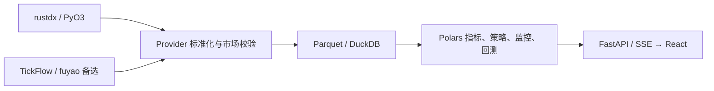

# rustdx 数据源

rustdx 是内置默认数据源，七类核心能力的初始值、重置值和界面缺省值统一为 rustdx。
TickFlow 和 fuyao 是两种备选数据源，各能力仍可独立选择。已移除的旧源路由在读取
时自动恢复为 rustdx，下次普通保存时持久化；其他有效用户选择保持原值。

## 沪深市场范围与升级

股票范围仅含沪主板、深主板、创业板、科创板；沪深 ETF 与指数保留。采集、行情
聚合、导入、指标、回测和持久化边界统一过滤不支持的市场代码，包括错误附上
沪深后缀的旧代码。股票身份仍按交易所对应代码前缀校验，不把指数或 ETF 当作股票。

`DataStore` 在加载视图和启动任务前执行幂等迁移：混合 Parquet 按证券行清理，
只含旧市场的文件删除，JSON 中旧证券引用和板块选项清除。成功完成才保存迁移标记；
发生读写错误则停止初始化。旧策略只选已删除板块时保留空候选状态，选择合法板块后
恢复；原本未限制板块的空列表语义不变。矩阵和浏览器缓存版本同步递增。

本地安装版与线上部署版共用这些规则。桌面版安装即用，服务端继续保留认证。
沪深历史 ST、公告日期、卖出印花税、T+1、滑点和涨跌停成交约束保持有效。

## 系统架构与调度



APScheduler 编排目录同步、竞价和盘后流水线。实时行情、分钟增量默认目标间隔为
1 秒；扩展行业与概念在显式配置后按 1 分钟更新。盘中任务采用北京时间交易日
09:15–11:30、13:00–15:15 的半开窗口，午休暂停；其他固定任务以各自门控为准。

## 支持能力

- 日 K
- 除权因子
- 实时行情
- 分钟 K
- 五档盘口
- 历史财务指标、三大报表和历史股本
- 全量分钟

行业、概念、龙虎榜和启用前的竞价历史不在这七类能力内，rustdx 当前不提供这些
数据。扩展分类仍由 `EXT_*_DATA_URL` 显式配置。历史 ST 治理数据和回测印花税
约束保持有效，当前证券目录不能代替历史状态。

## 原生运行时

后端通过 PyO3 原生扩展调用
[`jelven007/rustdx`](https://github.com/jelven007/rustdx) 中固定提交
`fac771a18cd218c90852254e59b040874d156722` 的 `rustdx-complete 1.12.0`。
依赖固定到提交而不是浮动分支。源码环境需要 Rust toolchain：

```bash
cd backend
uv sync --extra dev --extra rustdx --frozen
uv run --frozen --no-sync pytest tests/test_rustdx_provider.py tests/test_rustdx_contracts.py tests/test_rustdx_sync.py tests/test_rustdx_financial.py tests/test_rustdx_native_pool.py -q
```

Docker 镜像和桌面安装包会在构建阶段编译并包含原生扩展，运行目标机器不需要安装
Rust。

## 全市场连接池

全市场实时、竞价和盘口请求按每批最多 60 只标的拆分，由一个进程级持久连接池
调度。默认和硬上限均为 35 条连接：

```env
RUSTDX_QUOTE_CONNECTIONS=35
RUSTDX_WORKERS=35
RUSTDX_MAX_PAGES=64
RUSTDX_SERVER=117.34.114.13:7709
RUSTDX_FINANCIAL_SERVER=120.76.152.87:7709
RUSTDX_TIMEOUT=8
```

- `RUSTDX_QUOTE_CONNECTIONS`：全市场行情连接池大小，范围 `1..35`。
- `RUSTDX_WORKERS`：日 K、分钟 K、除权等按标的并行任务数，范围 `1..35`。
- `RUSTDX_MAX_PAGES`：单标的 K 线最大翻页数，范围 `1..80`。
- `RUSTDX_SERVER`：行情主站，格式为 `IP:PORT`。
- `RUSTDX_FINANCIAL_SERVER`：财务归档主站。行情站可能提供目录但不提供 ZIP，
  因此独立选择归档节点；切换节点时先释放槽位中的旧连接，不增加连接池上限。
- `RUSTDX_TIMEOUT`：连接与协议请求超时秒数，范围 `2..60`。

即使环境变量设置超过 35，Python Provider 和 Rust 原生桥接也会分别钳制到 35。
同一进程中的并发调用共享连接池，不会为每次请求再创建一组 35 条连接。
新建连接错峰，复用连接无需等待；失败最多尝试三次，关闭后旧池拒绝新请求。
日 K 按有限窗口流式产出，分钟增量只请求最新几根真实分钟 K。1 秒调度是目标
轮询间隔，实际完成时间受标的数量与公开节点性能约束，不承诺全市场 1 秒内完成。

固定股票池的 8–30 连接 P95 压测脚本、验收口径和结果文件见
[`rustdx 行情连接数压测`](rustdx-quote-benchmark.md)。

## 数据口径

rustdx Provider 在边界转换为项目统一契约：

- 代码：`600519.SH` / `000001.SZ`
- 日 K：不复权原始价格，成交量单位为手，成交额单位为元
- 分钟 K：北京时间墙钟，成交量单位为手
- 实时涨跌幅：小数制
- 五档数量：手
- 财务：原始 FINVALUE 字段映射，金额为元、股本为股；公告日期缺失的记录不进入历史计算

历史财务目录和文件均通过原生 rustdx TCP 下载，按目录声明的大小和 MD5 校验，
原子保存到 `data/cache/rustdx/financial/`。独立解析器限制解压大小、检查报告日期
与数据偏移。Python Provider、协议异常、财务解析均独立实现，运行不依赖旧数据源包。

历史 ST 采集命令为 `scripts.backfill_rustdx_st_history`，固定使用 rustdx，并保存到
`data/governance/st_history/rustdx_f10_latest.parquet`。已有历史证据的来源标签保持
真实记录；脚本执行仍需明确指定治理截止日。研究脚本按通用 F10 隔离标签后缀识别
未知状态，兼容此前的历史治理数据。

## 验证记录与实施顺序

2026-10-10 在 macOS arm64、同一公开行情节点测得：沪深股票目录 5,226 只，
全市场第一轮 2.069 秒，三次连接复用分别 0.313 / 0.282 / 0.508 秒，
各轮覆盖 5,226 只、池内连接均为 35。这是当次盘后测量，不代表交易日高峰 SLA。
股票、ETF、指数共 6 个样本的日线和分钟 OHLC、量额与此前 Python 协议源逐字段一致。
真实历史财务四期下载约 98 秒，校验通过后成功映射平安银行与贵州茅台的报表、
股本和公告日期；最新空报表不会生成虚假记录。

移除旧源后的本地验证：

- 后端全量回归：`2767 passed, 7 skipped`。
- 卸载旧依赖后的 rustdx、财务、原生连接池、配置和路由重置专项：`101 passed`。
- 历史 ST 治理专项：`10 passed`。
- 前端：`113 passed`，生产构建通过，ESLint 无错误；保留既有 77 条警告。
- 已卸载旧协议包，真实股票、指数、ETF 行情及日线读取成功；构建产物无旧源入口。
- 当前变更未增加 Python 静态检查诊断，`git diff --check` 通过。

上线按以下顺序进行：

1. 构建目标平台原生 wheel，执行原生协议、路由、财务、竞价和并发回归。
2. 发布包含原生扩展的后端和桌面包；确认能力矩阵七项均可用。
3. 新环境自动使用 rustdx；存量环境自动恢复已移除源的路由，核对其他有效选择。
4. 对固定股票、指数、ETF 样本运行只读对账，核对时间、价格、量额和除权事件。
5. 检查交易日门控、全市场覆盖率、耗时、池统计和财务缓存；按单项能力回滚。

Docker 与 Windows/Linux 的原生扩展由各平台构建流程生成，不能直接复用 macOS
wheel。当前本地验证不等同于这些平台的安装和容器运行验证。

## 回滚

每项能力独立路由。rustdx 出现异常时，可将备选源具备的能力手动切到 TickFlow 或
fuyao，并重新加载数据源；不需要转换或删除已有 Parquet 数据。备选源不具备的能力
会明确显示不可用，失败不会自动跨源获取数据。

## 沪深范围调整验证

2026-10-10 本次市场范围变更的后端全量回归为 `2777 passed, 7 skipped`；最终
导入、市场迁移和 Provider 专项 `132 passed`。前端 `113 passed`，生产构建通过，
ESLint 无错误并保留既有 77 条警告。新增迁移模块及测试 Ruff 通过，
`git diff --check` 通过。

本地约 1.5GB 数据扫描及迁移完成，未发现需删除的旧市场证券行；两份历史报告的
旧市场说明已清理。真实 rustdx 读取沪深目录 5226 只，核心指数行情及股票日线成功。
浏览器桥接两次超时，页面交互验证未完成。该记录不代表已发布安装包或已部署线上。

## Git 仓库版本验证

2026-10-10 将 `rustdx-complete` 从 crates.io `1.11.0` 切换为
`jelven007/rustdx` 提交 `fac771a18cd218c90852254e59b040874d156722`，该提交
crate 版本为 `1.12.0`。Cargo 依赖和锁文件均固定完整提交号，原生模块同时暴露并
校验版本及来源提交，避免旧二进制被误识别为当前版本。

- 上游库测试：排除会遍历全部公网节点的慢速网络测试后，`140 passed`；该慢速测试
  运行超过 60 秒后主动停止。
- TSP rustdx、原生连接池、同步、财务、竞价和路由专项：`112 passed`。
- TSP 后端全量回归：`2792 passed, 7 skipped`。
- `cargo fmt --check`、`cargo check --release --locked`、Ruff 和
  `git diff --check` 通过。
- 本机 CPython 3.12 release 扩展构建安装成功；真实读取股票行情、日线、分钟线、
  除权、当前财务和 5226 只沪深股票目录成功。
